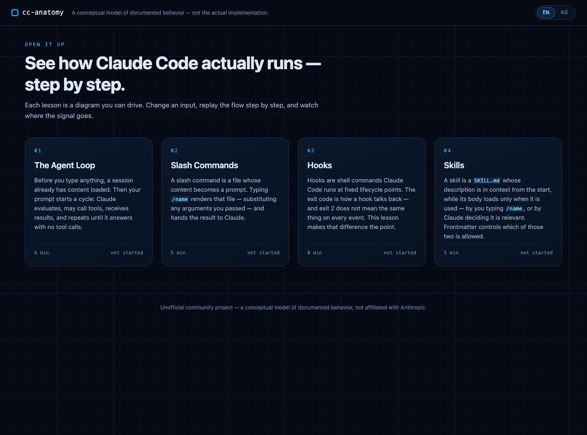
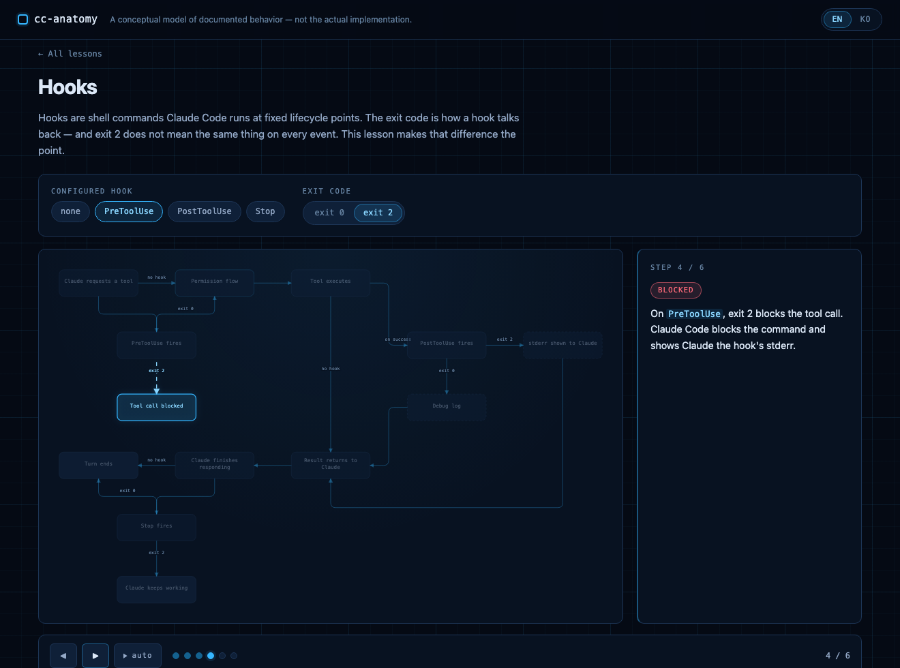

# cc-anatomy

[](https://github.com/oh-namgyu/cc-anatomy/actions/workflows/ci.yml)
[](LICENSE)

> **한글 요약** — Claude Code의 동작 원리(에이전트 루프·슬래시 명령·훅·스킬)를 입력을 바꿔가며 단계별 애니메이션으로 배우는 정적 웹앱입니다. 모든 스텝 설명에 공식 문서 인용 근거가 달려 있고, EN/KO를 전환할 수 있습니다. *(전체 한국어 문서: [README_KOR.md](README_KOR.md))*

An interactive, conceptual model of how Claude Code processes what you type.
Each lesson is a flow diagram you can drive: pick an input combination, and the
scenario replays step by step across the diagram with an explanation for every
step. Change the input, and a different path lights up.

Four lessons cover the agent loop, slash commands, hooks and skills. Every step
in every lesson is traceable to a line of official documentation.

It is a static site — no build step, no server, no API key, no account.

---

## ⚠️ Unofficial

**Unofficial community project. A conceptual model of Claude Code's documented
behavior — not the actual implementation, not affiliated with Anthropic.
Content grounded in official docs as of 2026-08; see
[docs/CONTENT-REVIEW.md](docs/CONTENT-REVIEW.md) for the per-step citation
audit.**

Where the documentation does not state an ordering, the diagram does not invent
one: those elements are drawn as an unordered cluster labelled as such. Where a
behavior is genuinely undocumented, the step carries an `undocumented` badge
instead of a guess.

---

## Screenshots

| Home | A lesson (L3 — Hooks) |
| :--- | :--- |
|  |  |

---

## Try it

**Live demo:** https://cc-anatomy.vercel.app

**Locally** — clone and serve the directory with anything that serves static
files:

```bash
git clone https://github.com/oh-namgyu/cc-anatomy.git
cd cc-anatomy

python3 -m http.server 6182     # then open http://127.0.0.1:6182
# or
npx serve .
```

Opening `index.html` from the filesystem does **not** work: the app is ES
modules, which browsers refuse to load over `file://`. Any static server will
do.

---

## Lessons

| # | Lesson | Minutes | What you drive |
| :-- | :--- | :-- | :--- |
| L1 | The Agent Loop | 6 | task type (question / edit) × `CLAUDE.md` absent or present |
| L2 | Slash Commands | 5 | command body with or without `$ARGUMENTS` × arguments given or not |
| L3 | Hooks | 8 | which hook is configured (off / PreToolUse / PostToolUse / Stop) × its exit code (0 / 2) |
| L4 | Skills | 5 | who invokes (you / Claude) × frontmatter (default / `disable-model-invocation`) |

Each lesson ends with three questions. Answering them marks the lesson complete;
progress is kept in `localStorage` and never leaves the browser.

L3 is the reason the exit-code branch is a first-class input: **`exit 2` does
not mean one thing.** It blocks a tool call under `PreToolUse`, feeds stderr
back to Claude under `PostToolUse`, and forces continuation under `Stop`. Each
of those is a separate scenario rather than a single simplified "blocked".

---

## How content accuracy works

The lessons were written as documentation before they were written as code, and
the review happened in between:

1. **Spec first** — [`docs/CONTENT-SPEC.md`](docs/CONTENT-SPEC.md) fixes every
   diagram node, every branch and all 127 scenario steps in prose, before any
   lesson data module exists.
2. **Citation audit** — [`docs/CONTENT-REVIEW.md`](docs/CONTENT-REVIEW.md) gives
   each step a row carrying the claim, the official page backing it and a
   **verbatim excerpt** from that page. The gate is not that a URL exists; it is
   that the excerpt says what the step says. 135 rows; 21 claims did not survive
   the check and were rewritten before implementation.
3. **Independent review** — a separate reviewer re-verified the contested areas
   (per-event exit-2 semantics, `stop_hook_active`, `PreToolUse` exit 0 not
   being approval, skill/command precedence) against live doc fetches, without
   being given the author's reasoning. Result: 0 findings. Recorded at the
   bottom of the review file.
4. **Only then, data** — lesson modules transcribe the reviewed spec. A schema
   gate in CI rejects a lesson whose steps reference diagram nodes that do not
   exist, or whose input combinations are not all covered by a scenario.

Every lesson also carries `sources` (linked as "Learn more" in the UI) and an
`asOf` date shown on screen.

**Corrections.** Claude Code changes; lessons are data, so a correction is a
data edit plus a redeploy. If you find a step that the documentation no longer
supports, open an issue with the doc URL and the excerpt — that is enough to
fix it.

---

## Similar projects

This is not the only interactive Claude Code learner, and it would be dishonest
to imply otherwise. Prior art worth your time:

- [**claude-code-visualizer**](https://github.com/jonwiggins/claude-code-visualizer)
  — interactive flowcharts of the agentic loop with scenario walkthroughs and a
  sandbox panel for permission modes and hooks.
- [**claude.nagdy.me**](https://claude.nagdy.me) — 12 interactive modules with a
  browser terminal simulator and quizzes.
- [**claude10x.com**](https://claude10x.com) — a 30-lesson interactive course
  spanning slash commands, memory, skills, subagents, MCP and hooks.

What cc-anatomy does differently, stated plainly:

- **Input-combination branching on the diagram itself.** Inputs are declared as
  a set of widgets with enumerated values, and every combination in the
  Cartesian product must map to its own scenario — enforced by a schema gate, so
  a branch cannot be quietly missing. You are not picking a pre-built scenario
  from a list; you are setting the inputs and watching which path results.
- **Bilingual EN/KO throughout**, not just the interface: every step
  explanation, badge, quiz question and answer exists in both languages, checked
  by the schema.
- **A per-step citation audit as a committed artifact**, with verbatim excerpts,
  visible to readers rather than an internal claim of accuracy.
- **No asserted ordering that the docs do not state.** Undocumented ordering is
  drawn as an unordered cluster; undocumented behavior gets a badge saying so.

Depth over breadth is the trade: four lessons here, versus 12 or 30 elsewhere.

---

## Development

```bash
npm ci                                  # dev dependency: @playwright/test only
npm test                                # node --test — schema gate + lesson data
npx playwright install chromium         # once
npx playwright test                     # e2e against a python3 static server
```

Runtime dependencies: none. The page loads nothing from an external host — no
CDN script, no web font, no analytics — enforced by a `default-src 'self'` CSP
meta tag. The only outbound links are `<a href>` links to the official docs.

**A lesson is a data module.** `js/lessons/*.js` export plain objects; the
engine (`js/engine/`) renders any object that passes the schema. Adding a
lesson means adding a file and one line in `js/lessons/index.js` — no engine
change. See [CONTRIBUTING.md](CONTRIBUTING.md) for the schema shape, the
validator error codes and the citation rule.

`node scripts/shots.mjs` regenerates the screenshots above.

---

## Roadmap

- **L5 — Subagents**: delegation through the Agent tool, background completion.
- **L6 — Permissions**: allowlist matching and the plan-mode gate.
- **Screen-reader pass**: a live region narrating step changes, beyond the
  current keyboard and `prefers-reduced-motion` support.

---

## License

[MIT](LICENSE) © 2026 oh-namgyu.

"Claude" and "Anthropic" are trademarks of Anthropic. This project is not
affiliated with, endorsed by, or sponsored by Anthropic, and uses no Anthropic
logo or brand asset.
